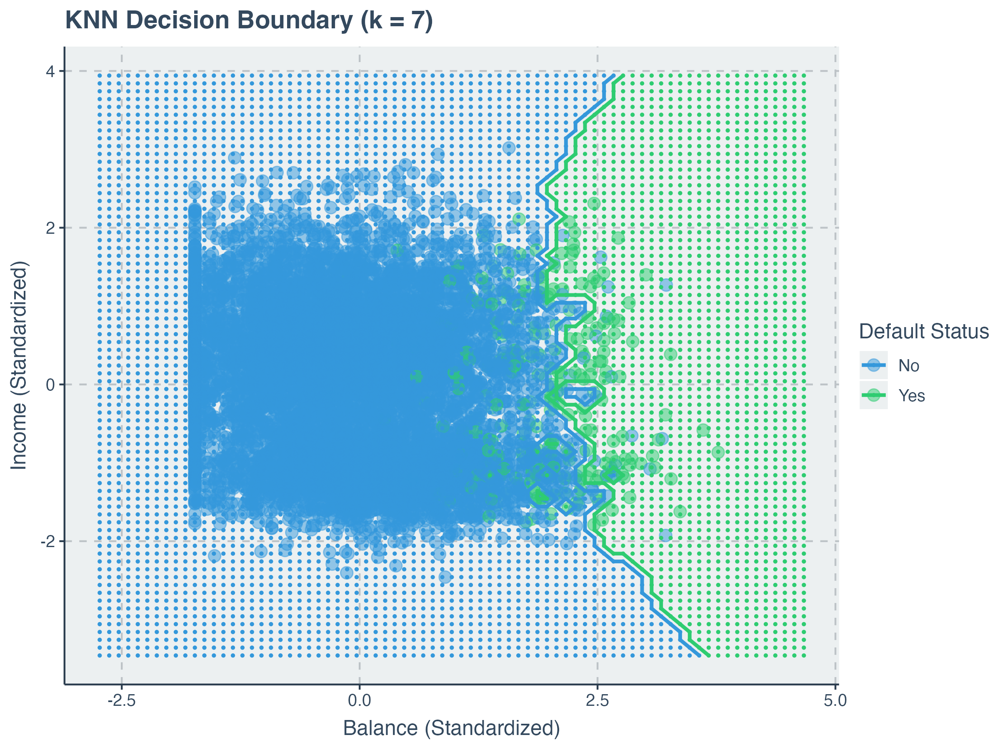

Credit Default Prediction Using K-Nearest Neighbors (KNN) in R  
This project demonstrates how to apply the K-Nearest Neighbors (KNN) algorithm (with k = 7 and k = 9) to predict credit default based on customer balance and income. It also includes data visualization, evaluation metrics, and DevOps best practices like version control, folder structure, containerization using Docker, and automation via GitHub Actions.

---

📁 Dataset  
- Source: `rdpmlr::credit` (no need to import external datasets)  
- Target column: `default` (Yes = defaulted, No = paid back)

---

🔍 Project Highlights  
- Implemented in **R** using `kknn`, `ggplot2`, and `caret`
- Data Preprocessing: Standardized numeric features
- Trained KNN models with **k = 7** and **k = 9**
- Visualizations:
  - Histogram of income and balance
  - Boxplots and scatterplots by default status
  - KNN decision boundary plot

---

📊 Model Results

### KNN with k = 9
| Metric     | Value   |
|------------|---------|
| Accuracy   | 0.961   |
| Precision  | 0.88    |
| Recall     | 0.53    |
| F1 Score   | 0.66    |

### KNN with k = 7
| Metric     | Value   |
|------------|---------|
| Accuracy   | 0.957   |
| Precision  | 0.84    |
| Recall     | 0.50    |
| F1 Score   | 0.63    |

**Observation:** Increasing `k` from 7 to 9 slightly improves precision and F1, while reducing recall.

---

 Sample Visualization  


---

🛠️  Tech Stack  
- **Language**: R  
- **Libraries**: `kknn`, `ggplot2`, `caret`, `dplyr`, `gridExtra`, `tidyverse`, `descr`

---

How to Run the Project

####  Option 1: Run Locally Using R

```bash
git clone https://github.com/emmasarps/knn_default_prediction.git
cd knn_default_prediction 
```

Then open R and run:

```r
source("R/credit_default_pro.R")
```

---

### 🐳 Option 2: Run with Docker (Recommended)

```bash
docker pull kwasisarpong/knn-r-script:latest
docker run --rm kwasisarpong/knn-r-script:latest
```
Or build manually and run:
```bash
docker pull kwasisarpong/knn-r-script:latest
docker run --rm kwasisarpong/knn-r-script:latest
```
This will generate all output plots inside the `plots/` directory.

---

###  CI/CD with GitHub Actions

- Builds the Docker image  
- Runs the R script in a clean container  
- Uploads result plots as artifacts  
-Automates and documents model runs
📂 Workflow: `.github/workflows/run_knn.ym`


---

### 📁 Folder Structure

```
knn_default_prediction/
├── R/
│   └── credit_default_pro.R         # Main R script
├── plots/
│   ├── balance_boxplot.png
│   ├── balance_histogram.png
│   ├── balance_vs_income_scatter.png
│   ├── income_histogram.png
│   └── knn_decision_boundary_k7.png
├── Dockerfile
├── .dockerignore
├── .gitignore
├── .github/
│   └── workflows/
│       └── run_knn.yml              # GitHub Actions workflow
└── README.md
```


📄 License
This project is open-source and licensed under the MIT License.
